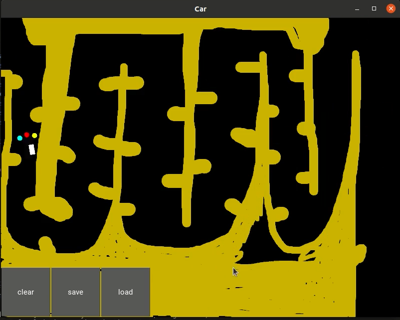

# Self driving car

- In this project I have implemented a virtual self driving car wich is trying to reach it's destination (up left corner and bottom right corner) while it's trying to learn to avoid sand and move in clear road through reinforcement learning.
- The technologies which I have used to implement this project are :
    - Pytorch (The brain of the car using Pytorch ANNS.)
    - kivy (The environment using Kivy library.)
    - Matplotlib (the visualization of the car performance)

## Table of contents

1. ai.py : the brain of the car 
2. map.py : the environment
3. map_commented.py: the enivornment also (well documented to understand all the details)
4. car.kv : the car used
5. last_brain.pth : the last saved brain of the car after some learning in the environment
6. requirments.txt : the required libraries
7. self driving car.mp4 : demo video of the car in the environment

## How to install and run the project.

- You need to install pytorch and kivy libraries in order to run the project.
- To run the project run the map.py file

## How to use the project.

after running the project you can left click on the mouse to start drawing some sand to the car and let it learn from it's new environment.

## Materials
- thanks to the great [Artificial Intelligence A-Z™: Learn How To Build An AI course](https://www.udemy.com/course/artificial-intelligence-az/) on udemy which is a hands on projects guide to learn reinforcment learning.
